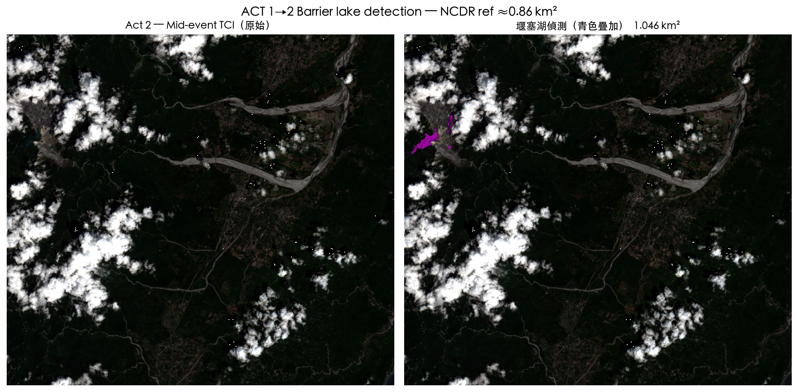
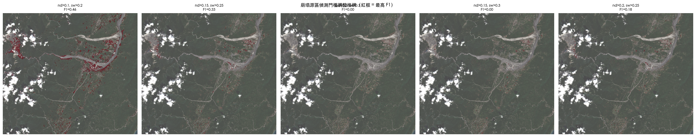
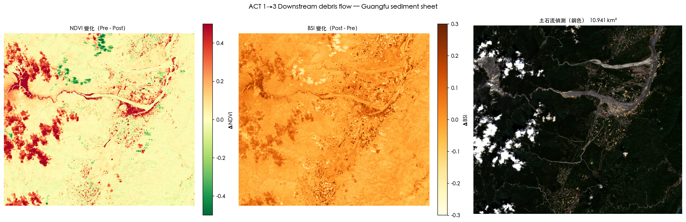
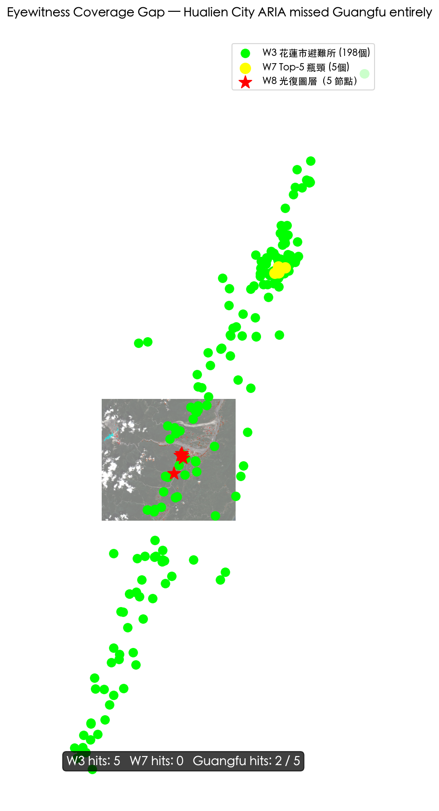

# Exercise 8 — Three-Act STAC Scene Selection

**ARIA v5.0：馬太鞍三幕稽核器**
2025 Matai'an Creek Barrier Lake Event（馬太鞍溪堰塞湖事件）

以 STAC + Sentinel-2 L2A cloud-native workflow，對 2025 年花蓮馬太鞍溪堰塞湖事件進行「事前 / 事中 / 事後」三幕光學遙測稽核。

---

## 事件三幕時間軸

| 幕 | 日期 | 事件 | TCI 特徵 |
|---|---|---|---|
| **Pre** | 2025-06-15 | 颱風威帕尚未來襲 | 鬱閉綠色森林谷地 |
| **Mid** | 2025-09-11 | 颱風威帕（7/21）暴雨引發大規模崩塌，阻塞馬太鞍溪形成 ~200 m 深堰塞湖 | 原森林中新增青藍色水體 |
| **Post** | 2025-10-16 | 9/23 14:50 堰塞湖溢頂，30 分鐘釋出 1540 萬 m³，台 9 線馬太鞍溪橋塌落，光復鄉被泥沙掩埋（18+ 罹難） | 湖泊消失、光復出現灰白色沉積鋪面 |

---

## 專案結構

```
.
├── Pre-lab-Week8.md                  # 課前準備文件
├── Week8-Student.ipynb               # 已執行完成的作業 notebook
├── Week8-Student-completed.ipynb     # 教師參考解答
├── data/
│   ├── guangfu_overlay.gpkg          # 光復 5 節點（Pre-lab Step 7b 自建）
│   ├── shelters_hualien.gpkg         # W3 避難所（198 個）
│   └── top5_bottlenecks.gpkg         # W7 道路瓶頸（5 個）
├── mataian_detections.gpkg           # 3 圖層：barrier_lake / landslide_source / debris_flow
├── impact_table.csv                  # 目擊衝擊表
└── output/
    ├── 07_lake_mask.png
    ├── 08_landslide_threshold_grid.png
    ├── 09_debris_mask.png
    ├── 10_three_masks.png
    └── 12_coverage_gap_map.png
```

---

## 偵測結果摘要

| 偵測項 | 面積 | 多邊形數 | 參考值 | 評估 |
|---|---|---|---|---|
| 堰塞湖（Mid） | **1.05 km²** | 8 | NCDR ~0.86 km² | ✅ 接近峰值 |
| 崩塌源區（Pre→Post） | **2.10 km²** | 197 | NCDR ~2–5 km² | ✅ 吻合 |
| 土石流鋪面（Pre→Post, 下游） | **10.94 km²** | 380 | 光復市街 4–5 km² | ⚠️ 略高（含季節性植被變化） |

## 衝擊稽核結果

| 圖層 | 命中 / 總數 | 說明 |
|---|---|---|
| W3 花蓮縣避難所 | **5 / 198** | 2.5% 命中——幾乎全縣避難所未在事件影響區 |
| W7 Top-5 道路瓶頸 | **0 / 5** | 全部位於花蓮市，離事件 30 km |
| W8 光復節點（自建） | **2 / 5** | 光復鄉公所、佛祖街沉積區被土石流覆蓋 |

---

## 成果圖

### 圖 07 — 堰塞湖偵測（Act 1→2）
青色為偵測出的堰塞湖水體（1.05 km²），位於馬太鞍溪上游萬榮鄉。



---

### 圖 08 — 崩塌源區門檻調整格網
5 個候選 (nir_drop, swir_post) 組合的視覺比對。F1 最高的 (0.10, 0.20) 面積達 23.8 km²，明顯是誤判擴散；改採 **(0.20, 0.25)** 得到 2.10 km²，更符合實際崩塌範圍。



> **教學點**：20 個 ground truth points 樣本太小，寬門檻容易拉高 recall 使 F1 虛高。必須配合視覺檢查，不可盲從 F1。

---

### 圖 09 — 下游土石流鋪面（Act 1→3）
左：NDVI 變化（紅=植被消失）；中：BSI 變化（橙黃=裸土增加）；右：土石流偵測疊加於 Post TCI。



---

### 圖 10 — 三幕綜合證據圖
左上 Act 2 堰塞湖（青）、右上 Act 3 崩塌源區（紅）、左下 Act 3 土石流（銅）、右下三幕疊加。


---

### 圖 12 — 覆蓋缺口稽核地圖
198 個 W3 避難所沿花蓮縣南北軸分布（綠點）、5 個 W7 瓶頸集中於花蓮市（黃點）、5 個 W8 光復節點（紅星）位於事件核心區。



> **一句話結論**：「花蓮縣 198 個避難所只有 5 個（2.5%）在事件影響區——ARIA v1–v4 的資源配置未能反映光復鄉的脆弱性。」

---

## 技術細節

- **STAC**：Microsoft Planetary Computer (`sentinel-2-l2a`)
- **AOI**：`121.28, 23.56, 121.52, 23.76`（馬太鞍溪上游 → 光復鄉）
- **CRS**：EPSG:32651（UTM 51N，Sentinel-2 原生）；向量圖層 EPSG:3826（TWD97 / TM2）
- **Bands**：B02, B03, B04, B08, B11, B12
- **Cloud-native**：只串流 AOI 範圍，不下載整張 10980×10980 tile
- **SAS token**：每次 `pc.sign(item)` 刷新，避免 1 小時後讀取失敗

### 三個核心偵測規則

```python
# C1 堰塞湖
lake = (nir_pre > 0.25) & (nir_mid < 0.15) & (blue_mid > 0.03) \
     & (green_mid > nir_mid) & (x < 121.33°E)        # 上游空間門限

# C2 崩塌源區
landslide = (nir_drop > 0.20) & (swir_post > 0.25) & (nir_pre > 0.25)

# C3 下游土石流
debris = (ndvi_change > 0.25) & (bsi_change > 0.10) & (nir_pre > 0.20) \
       & (x > 121.35°E) & ~lake & ~landslide         # 下游 + 排除重疊
```

---

## 執行環境

```bash
pip install pystac-client planetary-computer stackstac rioxarray xarray \
            geopandas rasterio scikit-learn dask tabulate anthropic
```

macOS CJK 字型：`Heiti TC`、`PingFang HK`、`Noto Sans TC`。

---

*"A STAC catalog is a library card — you don't carry the books home, you read them on the shelf."*
*"In the Matai'an case, the library happens to have photos of a lake that existed for only 64 days."*
